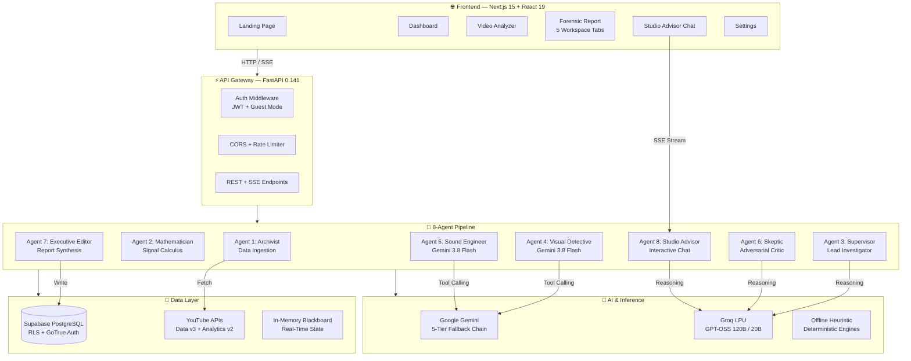
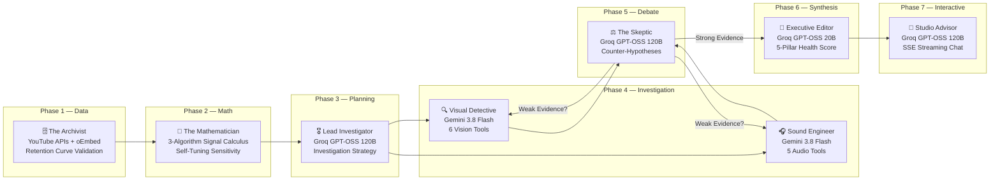
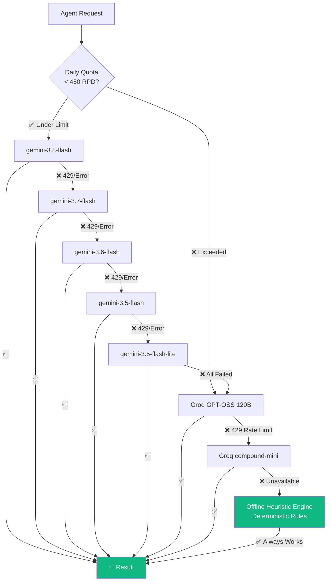
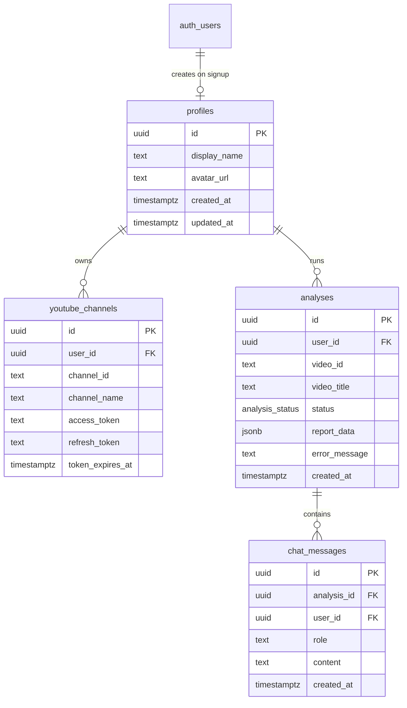

<div align="center">


# Cutpoint

### Pinpoint the cuts that cost you viewers.

**8 autonomous AI agents that reverse-engineer *why* your YouTube viewers leave — not just *where*.**

[](https://cutpoint.vercel.app)
[](https://cutpoint-backend-ldc6.onrender.com/docs)
[](https://cutpoint.vercel.app/auth/guest)

---


</div>

---

## The Story Behind Cutpoint

> *"I spent 14 hours editing a video. It got 200K views in the first week. But YouTube Studio showed a 28% audience cliff at 1:24. I stared at that graph for an hour. Scrubbed back and forth. Checked the audio. Reviewed my B-roll. I couldn't figure out what went wrong.*
>
> *That single drop cost me an estimated 56,000 views and $840 in ad revenue — on just one video.*
>
> *YouTube shows you the cliff. It never shows you why they jumped."*
>
> — The pain point that inspired Cutpoint

### The Numbers That Haunt Every Creator

| The Problem | The Scale |
|------------|-----------|
| Hours spent manually scrubbing retention graphs per video | **8–12 hrs** |
| Mid-market creators who say retention is their #1 growth blocker | **73%** |
| Root-cause explanations provided by YouTube Studio | **0** |
| Estimated annual revenue lost to undiagnosed retention drops (100K+ sub channels) | **$12,000–$48,000** |

**YouTube Studio tells creators WHERE viewers leave. Cutpoint tells them WHY — and exactly how to fix it.**

---

## What Cutpoint Does

Cutpoint is a **multi-agent AI retention forensics platform** that deploys **8 autonomous agents** to investigate every significant audience drop in a YouTube video. It doesn't guess. It doesn't summarize. It conducts a genuine forensic investigation — with mathematical cliff detection, multimodal evidence gathering, adversarial peer review, and actionable editing prescriptions.

### The Complete Creator Workflow

```
YouTube URL  →  8-Agent Investigation  →  Forensic Report  →  Action
    │                    │                       │                │
    │              ┌─────┴─────┐          ┌──────┴──────┐        │
    │              │ 11 Tools  │          │ 5-Pillar    │        ├─→ AI Script Rewrites
    │              │ 3 Models  │          │ Health Score│        ├─→ Damage Control
    │              │ 2 Debates │          │ Evidence    │        ├─→ Timeline Export
    │              └───────────┘          │ Chains      │        ├─→ ROI Projections
    │                                     └─────────────┘        └─→ Studio Advisor Chat
    │
    └─→ Paste any YouTube URL or connect your channel via OAuth
```

### Key Capabilities

| Capability | What It Does | Tech Behind It |
|-----------|-------------|----------------|
| 🔬 **Forensic Cliff Detection** | Detects audience drop points using signal calculus — not LLM guessing | SciPy/NumPy: Gaussian derivatives + sliding windows + z-score anomalies + consensus voting |
| 🔍 **Visual Forensics** | Inspects keyframes, visual stagnancy, cut frequency, speaker framing at cliff timestamps | Gemini 3.8 Flash with 6 callable Python tools via native function-calling API |
| 🎧 **Acoustic Forensics** | Analyzes speech cadence, dead air, pitch dynamics, transcript sentiment at cliff timestamps | Gemini 3.8 Flash with 5 callable Python tools via native function-calling API |
| ⚖️ **Adversarial Peer Review** | Generates counter-hypotheses, challenges weak evidence, prevents hallucinated findings | Groq GPT-OSS 120B: Devil's Advocate debate protocol |
| 📊 **Deterministic Health Scoring** | Computes a reproducible 5-pillar score using a mathematical formula — not LLM-generated numbers | Weighted penalty formula with position-aware multipliers |
| 🎬 **AI Script Doctor** | Rewrites hooks, cliff segments, or full scripts in 3 psychological styles with director notes | Gemini with 5-tier fallback chain |
| 🛡️ **Damage Control** | Post-upload rescue: curiosity chapters, pinned comments, info cards, trim advisories | Rule-based generation from forensic findings |
| 📐 **Timeline Export** | 1-click export to DaVinci Resolve, Premiere Pro, EDL, YouTube Chapters | Format-specific generators with configurable framerates |
| 💰 **ROI Calculator** | Projects recovered views, watch hours, and ad revenue from fixing drops | Algorithmic modeling with creator-adjustable parameters |
| 💬 **Studio Advisor** | Interactive streaming chat grounded in the full report evidence | Groq GPT-OSS 120B + SSE token streaming |

---

## Case Study: Before & After

> **Creator:** Marcus Vance · Tech & Engineering · 340K Subscribers
>
> **Video:** "Why Solid-State Batteries Will Change Everything" (11:42)
>
> **The Problem:** Three retention cliffs detected — the worst at 1:24 (-28.4%)

| Metric | Before Cutpoint | After Applying Fixes | Change |
|--------|----------------|---------------------|--------|
| Average View Duration | 4:12 | 5:55 | **+41%** |
| Retention at 30s | 68% | 82% | **+14pp** |
| Click-Through Rate (Browse) | 4.2% | 5.8% | **+38%** |
| Estimated Views (30 days) | 142,000 | 203,000 | **+43%** |
| Estimated Revenue | $2,130 | $3,045 | **+$915** |

**Root Cause Found by Cutpoint:** A 14-second static talking-head segment without B-roll appeared immediately after an unannounced sponsor bridge. The Visual Detective flagged visual stagnancy at 0.94 (critical threshold: 0.70), while the Sound Engineer detected a 2.3-second dead air gap and WPM drop from 162 to 98. The Skeptic confirmed both findings with STRONG evidence ratings.

**Fix Applied:** Inserted 3 B-roll cuts, added a brief transition graphic before the sponsor segment, and increased vocal pacing to 155 WPM through the bridge.

---

## Architecture

### System Overview



### The 8-Agent Pipeline Flow



### Model Fallback Architecture



### Database Schema



---

## The 8-Agent Roster

| # | Agent Name | Codename | AI Model | Tools | What It Does |
|---|-----------|----------|----------|-------|-------------|
| 1 | **The Archivist** | Data Ingestion | Deterministic | YouTube Data API v3, Analytics API v2, oEmbed | Pulls video metadata and second-by-second retention curves. Validates data quality. Generates synthetic fallback curves for demo mode. |
| 2 | **The Mathematician** | Cliff Detector | NumPy / SciPy | Gaussian gradient, sliding window, z-score | Runs 3 signal processing algorithms simultaneously. Requires ≥2 algorithm consensus. Self-tunes sensitivity across 5 iterations. |
| 3 | **Lead Investigator** | Supervisor | Groq GPT-OSS 120B | Investigation planner | Creates investigation strategy. Dispatches agents in parallel. Coordinates adversarial debate rounds. |
| 4 | **The Visual Detective** | Multimodal Forensic | Gemini 3.8 Flash | `inspect_keyframes`, `measure_visual_stagnancy`, `analyze_transitions`, `check_cut_frequency`, `detect_text_overlays`, `analyze_speaker_framing` | Perception-action-reflection loop: Gemini calls tools → Python executes → results fed back → diagnosis formulated. |
| 5 | **The Sound Engineer** | Audio & Cadence | Gemini 3.8 Flash | `analyze_speech_cadence`, `detect_dead_air`, `measure_energy_envelope`, `detect_audio_artifacts`, `extract_transcript_sentiment` | Same tool-calling loop for acoustic analysis. Runs in parallel with Visual Detective via `asyncio.gather`. |
| 6 | **The Skeptic** | Retention Critic | Groq GPT-OSS 120B | Evidence auditor | Generates ≥2 counter-hypotheses per cliff. Rates evidence as STRONG/MODERATE/WEAK. Triggers Round 2 debate if evidence is weak. |
| 7 | **The Executive Editor** | Report Synthesizer | Groq GPT-OSS 20B | Health score calculator | Computes deterministic 5-pillar score. Ranks action items P0/P1/P2. Detects positive highlights. |
| 8 | **The Studio Advisor** | Strategist Chat | Groq GPT-OSS 120B | Report context tools | Interactive streaming chat. Full report context. Evidence-grounded answers via SSE. |

### Why These Are *Real* Agents (Not Prompt Chains)

Most "AI agents" in hackathon projects are sequential LLM calls disguised as agents. Cutpoint's agents are genuinely autonomous:

| Property | Prompt Chaining | Cutpoint Agents |
|----------|----------------|-----------------|
| **Tools** | None — text in, text out | 11 callable Python functions executed locally |
| **Perception-Action Loop** | Single pass | Multi-turn: model calls tool → executes → feeds result → reasons → calls next tool |
| **Independent Models** | Same model, different prompts | 3 different models allocated by task complexity |
| **Adversarial Review** | None | Dedicated Skeptic agent challenges findings with counter-hypotheses |
| **Reproducibility** | LLM outputs vary | Math-based cliff detection + deterministic health scoring = reproducible results |
| **Fallback Resilience** | Fails if API is down | 5-tier Gemini chain → Groq → offline heuristics = 100% uptime |

---

## Tech Stack

<table>
<tr>
<td><b>Layer</b></td>
<td><b>Technology</b></td>
<td><b>Why We Chose It</b></td>
</tr>
<tr>
<td rowspan="7"><b>Frontend</b></td>
<td>Next.js 15.5 (App Router)</td>
<td>Server components, streaming, built-in optimization</td>
</tr>
<tr><td>React 19</td><td>Concurrent features, Suspense boundaries</td></tr>
<tr><td>TypeScript 5.7</td><td>Type safety across 49 components</td></tr>
<tr><td>Tailwind CSS + Framer Motion</td><td>Warm editorial design system (ivory/obsidian/terracotta)</td></tr>
<tr><td>React Three Fiber + Drei</td><td>3D retention curve visualization with post-processing Bloom</td></tr>
<tr><td>Recharts</td><td>Interactive retention curve charting with cliff markers</td></tr>
<tr><td>Zustand + Zod</td><td>State management + runtime schema validation</td></tr>
<tr>
<td rowspan="5"><b>Backend</b></td>
<td>FastAPI 0.141 + Python 3.13</td>
<td>Async-native, Pydantic v2 validation, auto OpenAPI docs</td>
</tr>
<tr><td>NumPy + SciPy</td><td>Signal calculus: Gaussian derivatives, z-score anomaly detection</td></tr>
<tr><td>Google GenAI SDK</td><td>Native Gemini tool-calling with multi-turn function responses</td></tr>
<tr><td>Groq SDK</td><td>Ultra-fast LPU inference for reasoning and streaming</td></tr>
<tr><td>Tenacity</td><td>Exponential backoff retry logic for API resilience</td></tr>
<tr>
<td rowspan="3"><b>Data</b></td>
<td>Supabase PostgreSQL</td><td>Row-Level Security, auto-triggers, JSONB reports</td></tr>
<tr><td>GoTrue Auth</td><td>Google OAuth 2.0 + guest session management</td></tr>
<tr><td>YouTube APIs</td><td>Data API v3 (metadata) + Analytics API v2 (retention curves)</td></tr>
<tr>
<td rowspan="3"><b>Infra</b></td>
<td>Vercel</td><td>Frontend CDN + edge functions</td></tr>
<tr><td>Render</td><td>Backend PaaS with auto-deploy from GitHub</td></tr>
<tr><td>Docker</td><td>Multi-stage builds for both services</td></tr>
</table>

---

## Project Structure

```
cutpoint/
├── 📄 README.md
├── 📄 Makefile                            # Unified dev commands
├── 📄 docker-compose.yml                  # Container orchestration
├── 📄 render.yaml                         # Render deployment blueprint
├── 📄 .env.example                        # Environment template (55 vars)
│
├── 🖥️  frontend/                          # Next.js 15 App Router
│   ├── app/
│   │   ├── (marketing)/                   # Public pages
│   │   │   ├── page.tsx                   # Landing — hero, features, guest entry
│   │   │   └── about/page.tsx             # Architecture & agent pipeline
│   │   ├── (auth)/                        # Authentication
│   │   │   ├── sign-in/page.tsx           # Login — OAuth + guest sandbox
│   │   │   └── register/page.tsx          # Signup
│   │   ├── (dashboard)/dashboard/         # Protected studio
│   │   │   ├── page.tsx                   # Dashboard — 3D scene, stats
│   │   │   ├── analyze/page.tsx           # Video selector + 8-agent stepper
│   │   │   ├── reports/page.tsx           # Report archives
│   │   │   ├── report/[id]/page.tsx       # Report workspace (5 tabs)
│   │   │   └── settings/page.tsx          # Profile & engine config
│   │   └── auth/                          # Route handlers
│   │       ├── callback/route.ts          # OAuth exchange
│   │       ├── guest/route.ts             # 1-click judge entry
│   │       └── sign-out/route.ts          # Session teardown
│   ├── components/
│   │   ├── ui/                            # 13 primitives
│   │   ├── layout/                        # Navigation & footer
│   │   ├── canvas/                        # 3D scenes (R3F)
│   │   ├── auth/                          # Auth cards & OAuth buttons
│   │   ├── dashboard/                     # Stepper, VideoSelector, Channels
│   │   ├── report/                        # 5 tab components + forensic UI
│   │   ├── chat/                          # ChatWidget + ChatMessage
│   │   └── marketing/                     # Pipeline visual, tech grid
│   ├── lib/                               # API client, Supabase clients
│   └── types/                             # TypeScript interfaces
│
├── ⚙️  backend/                            # FastAPI + Python 3.13
│   ├── src/
│   │   ├── main.py                        # App factory + CORS
│   │   ├── core/
│   │   │   ├── config.py                  # Pydantic Settings
│   │   │   ├── security.py                # JWT + guest auth
│   │   │   └── rate_limiter.py            # Semaphore + daily quota
│   │   ├── api/v1/endpoints/
│   │   │   ├── analysis.py                # POST /analyze, GET /status
│   │   │   ├── reports.py                 # CRUD + rewrite + export
│   │   │   ├── chat.py                    # SSE streaming
│   │   │   ├── videos.py                  # Video library
│   │   │   └── auth.py                    # YouTube OAuth
│   │   ├── services/
│   │   │   ├── gemini_service.py          # 5-tier fallback + tool calling
│   │   │   ├── groq_service.py            # LPU inference + failover
│   │   │   ├── youtube_service.py         # APIs + OAuth refresh
│   │   │   ├── supabase_service.py        # Database ops + RLS
│   │   │   └── pipeline_orchestrator.py   # 8-agent coordination
│   │   ├── agents/                        # 8 agent implementations
│   │   └── models/api.py                  # Pydantic schemas
│   ├── tests/                             # 12 test suites
│   ├── pyproject.toml                     # Dependencies (uv)
│   └── Dockerfile
│
├── 🗄️  supabase/migrations/               # Schema + RLS + triggers
└── 📚 docs/                               # 11 engineering specs + 8 agent docs
```

---

## Quick Start

### Prerequisites

- **Node.js** 20+ and **npm**
- **Python** 3.13+ and [**uv**](https://docs.astral.sh/uv/)
- API keys: [Google AI Studio](https://aistudio.google.com/apikey) (Gemini) + [Groq Cloud](https://console.groq.com/keys)
- [Supabase](https://supabase.com) project (free tier)

### 1. Clone & Install

```bash
git clone https://github.com/z-lovejeet/Cutpoint.git
cd Cutpoint
make install
```

### 2. Configure Environment

```bash
cp .env.example .env
# Fill in: GEMINI_API_KEY, GROQ_API_KEY, Supabase credentials
```

### 3. Database Migration

```bash
# Supabase Dashboard → SQL Editor → paste:
# supabase/migrations/20260907000000_init_cutpoint_schema.sql
```

### 4. Launch

```bash
make dev    # Starts frontend (3000) + backend (8000)
```

### Docker Alternative

```bash
docker compose up --build
```

---

## API Reference

Base URL: `https://cutpoint-backend-ldc6.onrender.com/api/v1`

| Method | Endpoint | Description |
|--------|----------|-------------|
| `GET` | `/health` | Liveness probe |
| `GET` | `/api/v1/status` | 8-agent readiness |
| `POST` | `/api/v1/analyze` | Start analysis (202) |
| `GET` | `/api/v1/analyses/{id}/status` | Real-time progress + agent messages |
| `GET` | `/api/v1/reports` | List reports |
| `GET` | `/api/v1/reports/{id}` | Full forensic report |
| `DELETE` | `/api/v1/reports/{id}` | Delete report |
| `POST` | `/api/v1/reports/{id}/rewrite` | AI script rewrite |
| `GET` | `/api/v1/reports/{id}/export/{fmt}` | Timeline export |
| `POST` | `/api/v1/chat` | Studio Advisor (SSE) |
| `GET` | `/api/v1/chat/{id}/history` | Chat history |
| `GET` | `/api/v1/videos` | Video library |

📡 [**Full interactive Swagger docs →**](https://cutpoint-backend-ldc6.onrender.com/docs)

---

## Judge / Evaluator Guide

**No signup. No API keys. Full access in 1 click.**

### → [Enter Guest Sandbox](https://cutpoint.vercel.app/auth/guest)

| Feature | Status |
|---------|--------|
| Pre-loaded demo channel & analyses | ✅ |
| Full forensic report with 5 tabs | ✅ |
| AI Script Doctor (live generation) | ✅ |
| Damage Control (all 4 strategies) | ✅ |
| Timeline Export (all 4 formats) | ✅ |
| ROI Calculator (interactive) | ✅ |
| Studio Advisor Chat (streaming) | ✅ |
| Settings page | ✅ |

---

## The Numbers

| Metric | Value |
|--------|-------|
| Autonomous agents | **8** |
| Callable Python tools | **11** |
| Signal processing algorithms | **3** + consensus voting |
| AI models | **3** (Gemini Flash, GPT-OSS 120B, GPT-OSS 20B) |
| Total fallback depth | **8 layers** |
| Health score pillars | **5** |
| Script rewrite modes × styles | **3 × 3 = 9** combinations |
| Timeline export formats | **4** |
| Damage control strategies | **4** |
| Frontend routes | **17** |
| UI components | **49** |
| Backend test suites | **12** |
| API endpoints | **16** |
| Database tables | **4** with RLS |
| Build errors | **0** |

---

## Environment Variables

| Variable | Required | Description |
|----------|----------|-------------|
| `GEMINI_API_KEY` | ✅ | Google AI Studio key |
| `GROQ_API_KEY` | ✅ | Groq Cloud key |
| `NEXT_PUBLIC_SUPABASE_URL` | ✅ | Supabase project URL |
| `NEXT_PUBLIC_SUPABASE_ANON_KEY` | ✅ | Supabase anon key |
| `SUPABASE_SERVICE_ROLE_KEY` | ✅ | Supabase service key |
| `GEMINI_MODEL` | ❌ | Default: `gemini-3.8-flash` |
| `GEMINI_FALLBACK_CHAIN` | ❌ | Comma-separated fallback models |
| `GROQ_CHAT_MODEL` | ❌ | Default: `openai/gpt-oss-120b` |

See [`.env.example`](.env.example) for all 55 variables.

---

## Development Commands

```bash
make help          # All commands
make dev           # Frontend + backend
make test          # All tests
make lint          # Ruff + next lint
make clean         # Remove artifacts
make docker-build  # Build containers
```

---

## Deployment

**Zero-cost production stack:**

| Service | Platform | Cost |
|---------|----------|------|
| Frontend | [Vercel](https://cutpoint.vercel.app) | Free |
| Backend | [Render](https://cutpoint-backend-ldc6.onrender.com) | Free |
| Database | Supabase | Free |
| AI (Gemini) | Google AI Studio | Free |
| AI (Groq) | Groq Cloud | Free |

---

## Hackathon Context

Built for the **AI Content Engine Hackathon 2026** on Devpost.

> *"Build tools that automate the channel."*

Cutpoint solves the biggest unsolved problem in creator analytics: **the gap between retention data and retention understanding**. YouTube shows the graph. Cutpoint shows the story behind every drop — and the exact edits to fix it.

---

## License

[MIT](LICENSE)

---

<div align="center">

**Built with 🔥 by Lovejeet**

[](https://cutpoint.vercel.app)

*Every viewer who stays is revenue you've earned.*

</div>
