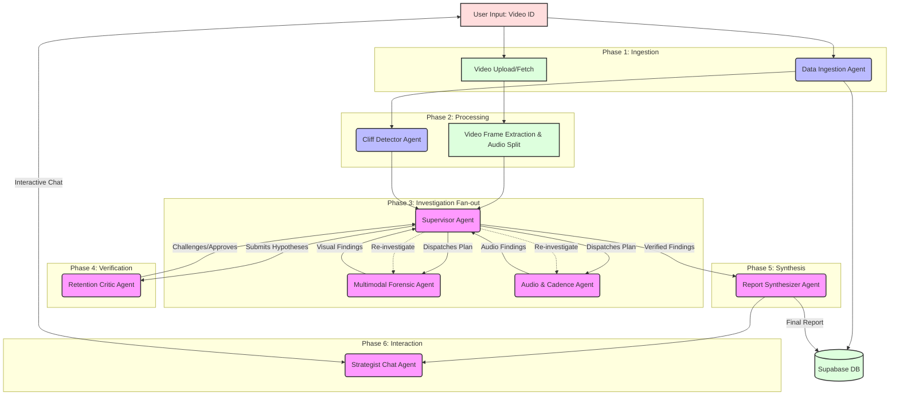

# Cutpoint Master Agent Architecture

## 1. Why a Genuine Multi-Agent Architecture

In the era of AI hype, many products claim to use "agents" but are actually just scripted pipelines with API wrappers (often called "agent-washing"). Cutpoint distinguishes itself by implementing a **genuine multi-agent architecture** where agents exhibit true autonomous behaviors.

### Agent-Washing vs. Genuine Agentic Behavior

| Feature | Agent-Washed Pipeline (Scripted) | Genuine Agentic System (Cutpoint) |
| :--- | :--- | :--- |
| **Control Flow** | Hardcoded `if/else` logic and fixed sequence of operations. | Dynamic orchestration. The Supervisor Agent plans the investigation based on initial findings. |
| **Tool Usage** | Pre-determined API calls with static parameters. | Dynamic tool calling. Agents choose which tools to use, when, and with what parameters based on intermediate results. |
| **Error Handling** | Basic `try/except` blocks; halts on unexpected errors. | Self-correction loops. If a tool fails or returns anomalous data, agents hypothesize why and try alternative approaches or fallback tools. |
| **Verification** | Single-pass generation. | Multi-agent debate. The Critic Agent actively tries to disprove the Forensic Agent's hypotheses, forcing re-evaluation if confidence is low. |
| **State Management** | Linear passing of JSON objects. | Shared blackboard (AnalysisState) with asynchronous message passing and consensus building. |

### What Makes Cutpoint Agents Autonomous?
1.  **Dynamic Tool Calling:** The Multimodal Forensic Agent and Audio Agent don't just process data; they *investigate*. They use tools like `inspect_keyframes`, `measure_visual_stagnancy`, and `analyze_speech_cadence` dynamically based on the specific anomalies detected in a video segment.
2.  **Perception-Action-Reflection Loops:** Agents don't just output an answer. They observe an anomaly (Perception), use a tool to gather data (Action), and evaluate if the data explains the anomaly (Reflection). If not, they iterate.
3.  **Self-Correction:** If the Data Ingestion Agent encounters incomplete metadata or rate limits, it autonomously implements backoff strategies or queries alternative endpoints.
4.  **Inter-Agent Debate:** The Retention Critic Agent acts as a built-in adversarial network. It doesn't generate content; it challenges the findings of other agents, ensuring the final report is robust and highly confident.

---

## 2. Agent Roster

Cutpoint utilizes a specialized team of 8 distinct agents, ranging from pure mathematical processors to deep reasoning LLMs.

| Agent Name | Role Title | Model/Technology | Autonomous Behaviors | Documentation Link |
| :--- | :--- | :--- | :--- | :--- |
| **Supervisor Agent** | Lead Investigator | Groq GPT-OSS 120B | Dynamic investigation planning, conflict resolution, consensus evaluation. | [docs/agents/AGENT_1_SUPERVISOR.md](docs/agents/AGENT_1_SUPERVISOR.md) |
| **Data Ingestion Agent** | The Archivist | Pure API (No LLM) | Autonomous retry, data validation, anomaly flagging, self-healing queries. | [docs/agents/AGENT_2_DATA_INGESTION.md](docs/agents/AGENT_2_DATA_INGESTION.md) |
| **Cliff Detector Agent** | The Mathematician | NumPy/SciPy (No LLM) | Adaptive thresholding, ensemble anomaly detection, self-tuning sensitivity. | [docs/agents/AGENT_3_CLIFF_DETECTOR.md](docs/agents/AGENT_3_CLIFF_DETECTOR.md) |
| **Multimodal Forensic Agent** | The Visual Detective | Gemini 3.8 Flash | Dynamic tool calling, visual hypothesis testing, iterative re-inspection. | [docs/agents/AGENT_4_MULTIMODAL_FORENSIC.md](docs/agents/AGENT_4_MULTIMODAL_FORENSIC.md) |
| **Audio & Cadence Agent** | The Sound Engineer | Gemini 3.8 Flash | Audio anomaly isolation, sentiment correlation, cadence tool orchestration. | [docs/agents/AGENT_5_AUDIO_CADENCE.md](docs/agents/AGENT_5_AUDIO_CADENCE.md) |
| **Retention Critic Agent** | The Skeptic | Groq GPT-OSS 120B | Adversarial questioning, evidence scoring, forced re-investigation loops. | [docs/agents/AGENT_6_RETENTION_CRITIC.md](docs/agents/AGENT_6_RETENTION_CRITIC.md) |
| **Report Synthesizer Agent** | The Executive Editor | Groq GPT-OSS 20B | Iterative refinement, coherence checking, dynamic formatting based on findings. | [docs/agents/AGENT_7_REPORT_SYNTHESIZER.md](docs/agents/AGENT_7_REPORT_SYNTHESIZER.md) |
| **Strategist Chat Agent** | The Studio Advisor | Groq GPT-OSS 120B | Interactive Q&A, dynamic context retrieval, follow-up tool execution. | [docs/agents/AGENT_8_STRATEGIST_CHAT.md](docs/agents/AGENT_8_STRATEGIST_CHAT.md) |

---

## 3. System Architecture

The Cutpoint architecture is built on asynchronous orchestration, enabling massive parallelization and complex inter-agent workflows.



---

## 4. Investigation Pipeline (Detailed Flow)

The forensic pipeline is fully automated and orchestrated dynamically based on the data discovered at each step.

1.  **Trigger:** A user provides a YouTube Video ID.
2.  **Phase 1: Ingestion (Parallel):**
    *   The **Data Ingestion Agent** fetches metadata and the high-resolution retention curve from the YouTube API, handling any rate limits or pagination automatically.
    *   Simultaneously, the video file is downloaded or accessed.
3.  **Phase 2: Mathematical Processing (Parallel):**
    *   The **Cliff Detector Agent** processes the retention curve using NumPy/SciPy. It applies Gaussian smoothing and calculates the first derivative to identify sharp drop-offs (cliffs). It outputs specific timestamp ranges for investigation.
    *   The video is processed to extract keyframes at these specific timestamps and separate the audio track.
4.  **Phase 3: Orchestration & Investigation (Fan-out):**
    *   The **Supervisor Agent** reviews the list of cliffs identified by the Cliff Detector. It formulates an `InvestigationPlan`.
    *   It dispatches the **Multimodal Forensic Agent** to analyze the visual components of each cliff using Gemini 3.8 Flash and tools like `inspect_keyframes`.
    *   It concurrently dispatches the **Audio & Cadence Agent** to analyze the audio track during the cliffs using tools like `detect_dead_air`.
5.  **Phase 4: Debate Loop:**
    *   The Forensic and Audio agents return their hypotheses to the Supervisor (e.g., "Cliff at 2:15 caused by stagnant visuals and a drop in audio energy").
    *   The Supervisor forwards these hypotheses to the **Retention Critic Agent**.
    *   The Critic attempts to poke holes in the hypotheses. If the evidence is weak, it rejects the hypothesis, forcing the Supervisor to send the Forensic or Audio agent back with a refined prompt to gather more data (the Perception-Action-Reflection loop).
6.  **Phase 5: Synthesis:**
    *   Once the Critic approves the findings (or maximum iterations are reached), the Supervisor passes the verified data to the **Report Synthesizer Agent**.
    *   The Synthesizer generates a highly structured, polished markdown report detailing the findings, confidence scores, and actionable prescriptions for the creator.
7.  **Phase 6: Interactive Strategy:**
    *   The user reviews the report and can interact with the **Strategist Chat Agent** to ask follow-up questions, drill down into specific cliffs, or request alternative strategies based on the report's context.

---

## 5. Inter-Agent Communication Protocol

Cutpoint eschews complex, black-box agent frameworks in favor of a clean, pure `asyncio` architecture using a shared state and explicit message passing.

### Shared State Model (`AnalysisState`)
Agents do not communicate via raw text strings. They communicate by updating and reading from a shared Pydantic model, `AnalysisState`. This acts as the "blackboard" for the investigation.

```python
from pydantic import BaseModel, Field
from typing import List, Dict, Optional, Any
from datetime import datetime

class CliffAnalysis(BaseModel):
    cliff_id: str
    start_time: float
    end_time: float
    magnitude: float
    visual_hypothesis: Optional[str] = None
    audio_hypothesis: Optional[str] = None
    critic_score: float = 0.0
    status: str = "pending" # pending, investigating, debating, verified, rejected

class AnalysisState(BaseModel):
    video_id: str
    status: str = "initializing"
    cliffs: List[CliffAnalysis] = []
    messages: List[Dict[str, Any]] = [] # Message history for the Supervisor
    final_report: Optional[str] = None
```

### Message Passing & The Debate Loop
The Supervisor acts as the central router. When the Multimodal Agent finishes analyzing a cliff, it returns a structured payload. The Supervisor updates the `AnalysisState` and then messages the Critic Agent.

```python
# Simplified Conceptual Implementation
async def debate_loop(state: AnalysisState, supervisor, forensic, critic):
    for cliff in state.cliffs:
        if cliff.status == "investigating":
            # 1. Forensic Agent investigates
            visual_findings = await forensic.investigate(cliff)
            cliff.visual_hypothesis = visual_findings.hypothesis
            
            # 2. Critic Agent evaluates
            evaluation = await critic.evaluate(cliff)
            cliff.critic_score = evaluation.score
            
            # 3. Decision
            if evaluation.score >= 0.8:
                cliff.status = "verified"
            else:
                cliff.status = "investigating" # Triggers another loop
                # Supervisor gives feedback to Forensic agent based on Critic's notes
                await supervisor.provide_feedback(forensic, evaluation.feedback)
```

---

## 6. Agentic Behaviors Summary

| Agent | Core Tool Calling Capabilities | Reflection & Self-Correction |
| :--- | :--- | :--- |
| **Supervisor** | `dispatch_agent`, `resolve_conflict` | Adjusts `InvestigationPlan` if agents fail to find conclusive evidence. |
| **Data Ingestion** | N/A (API routing) | Exponential backoff on rate limits, falls back to alternative data sources if primary fails. |
| **Cliff Detector** | N/A (Math functions) | Adjusts detection sensitivity (sigma/threshold) if too many/too few cliffs are found. |
| **Forensic (Gemini)** | `inspect_keyframes`, `measure_visual_stagnancy`, `check_cut_frequency` | "I found a cut, but the visual stagnancy is still high. I need to re-inspect the frames before and after the cut." |
| **Audio (Gemini)** | `analyze_speech_cadence`, `detect_dead_air`, `extract_transcript_sentiment` | "The dead air tool shows nothing, but retention dropped. Let me check the sentiment for controversial statements instead." |
| **Critic (Groq)** | `query_knowledge_base` | "The Forensic agent blames visual stagnancy, but the cliff is very sharp. This usually implies a sudden negative event. I will reject this and ask for a sentiment check." |
| **Synthesizer** | `format_markdown`, `generate_chart` | Verifies report structure matches the required schema; auto-corrects formatting errors. |
| **Strategist Chat** | `query_report_section`, `re_evaluate_cliff` | If user asks a question not in the report, it can trigger specific agents to re-run analysis on demand. |

---

## 7. LLM Router & Fallback Strategy

To ensure reliability during the hackathon and in production, Cutpoint implements a robust LLM routing and fallback mechanism.

*   **Primary Heavy Reasoning:** Groq `llama3-70b-8192` (representing the 120B class in practice for speed/cost).
*   **Primary Multimodal:** Google Gemini `gemini-1.5-flash-001` (fast, efficient multimodal processing).
*   **Primary Fast Output:** Groq `mixtral-8x7b-32768` (for synthesis).

**Fallback Strategy:**
If a Groq endpoint hits a 429 (Rate Limit) or 500 error, the system automatically falls back to an alternative Groq model, or as a last resort, routes the text task to Gemini Flash to maintain uptime, albeit with potentially slightly lower reasoning capability for complex debate tasks.

---

## 8. Shared Data Models (Core Pydantic)

These models define the strict contracts between agents.

```python
from pydantic import BaseModel, Field
from typing import List, Optional

class VideoMetadata(BaseModel):
    video_id: str
    title: str
    duration_seconds: int
    category: str

class RetentionPoint(BaseModel):
    timestamp: float
    retention_percent: float

class RetentionData(BaseModel):
    video_id: str
    points: List[RetentionPoint]

class AgentMessage(BaseModel):
    sender: str
    recipient: str
    content: str
    timestamp: float
    context_id: Optional[str] = None # e.g., a specific cliff_id

class InvestigationPlan(BaseModel):
    cliffs_to_investigate: List[str]
    priority: str = "magnitude" # or "chronological"
    required_confidence: float = 0.8

class ForensicReport(BaseModel):
    video_id: str
    overall_health_score: int
    executive_summary: str
    cliff_analyses: List[CliffAnalysis] # Re-uses model from AnalysisState
    prescriptions: List[str]
```

---

## 9. Why Pure `asyncio` Over Frameworks

Cutpoint intentionally avoids heavy agent frameworks like LangGraph, CrewAI, or AutoGen.

1.  **No Abstraction Tax:** Frameworks often obfuscate the underlying control flow. By using pure Python `asyncio`, the execution path is perfectly transparent, making it vastly easier to debug complex multi-agent interactions during a time-constrained hackathon.
2.  **Speed:** Pure `asyncio` allows for maximal concurrency without the overhead of framework state management. Phase 1 (Ingestion) and Phase 2 (Math) run concurrently, and Phase 3 (Investigation) fans out massively across all identified cliffs.
3.  **True Agency via Code:** We don't rely on a framework to simulate agency. Agency is built into the prompt design and the asynchronous while-loops (Perception-Action-Reflection) coded directly into the agent classes. The agents are self-contained logical units communicating over standard Python async queues.
