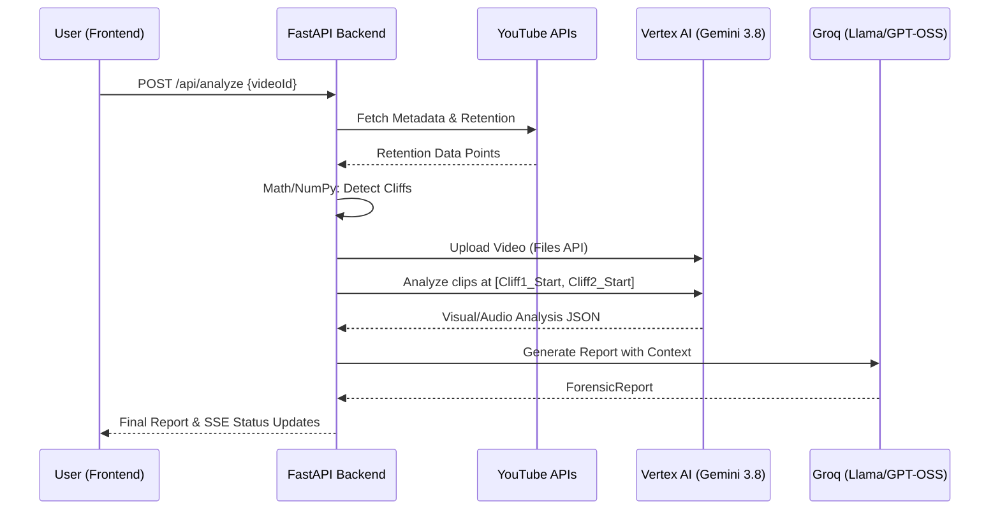

# Cutpoint Data Schema

This document defines the complete data models for the Cutpoint platform across the Python Backend (Pydantic), Next.js Frontend (TypeScript), and Supabase Database (SQL).

## 1. Pydantic Models (Python Backend)

```python
from datetime import datetime
from enum import Enum
from typing import List, Optional
from pydantic import BaseModel, Field, HttpUrl, validator

class VideoMetadata(BaseModel):
    video_id: str = Field(..., description="Unique YouTube Video ID")
    title: str = Field(..., description="Title of the video")
    description: str = Field(..., description="Video description text")
    channel_id: str = Field(..., description="Unique YouTube Channel ID")
    channel_name: str = Field(..., description="Name of the channel")
    duration_seconds: int = Field(..., description="Total duration of the video in seconds")
    view_count: int = Field(0, description="Total views")
    like_count: int = Field(0, description="Total likes")
    comment_count: int = Field(0, description="Total comments")
    published_at: datetime = Field(..., description="Publish date and time")
    thumbnail_url: HttpUrl = Field(..., description="URL to the highest resolution thumbnail")

    @validator("duration_seconds")
    def duration_must_be_positive(cls, v):
        if v <= 0:
            raise ValueError("Duration must be positive")
        return v

class RetentionDataPoint(BaseModel):
    time_ratio: float = Field(..., ge=0, le=1.0, description="Time index as a ratio (0.0 to 1.0)")
    watch_ratio: float = Field(..., ge=0, le=1.0, description="Percentage of audience watching (0.0 to 1.0)")
    timestamp_seconds: int = Field(..., description="Time in seconds")

class RetentionData(BaseModel):
    video_id: str = Field(..., description="Reference to Video ID")
    data_points: List[RetentionDataPoint] = Field(..., description="List of retention data points over time")
    average_retention: float = Field(..., ge=0, le=1.0, description="Overall average retention percentage")
    total_duration_seconds: int = Field(..., description="Total duration in seconds")

class CliffSeverity(str, Enum):
    CRITICAL = "CRITICAL"
    HIGH = "HIGH"
    MEDIUM = "MEDIUM"
    LOW = "LOW"

class CliffPoint(BaseModel):
    timestamp_start: int = Field(..., description="Start of the cliff drop in seconds")
    timestamp_end: int = Field(..., description="End of the cliff drop in seconds")
    drop_percentage: float = Field(..., ge=0, le=100.0, description="Absolute drop in retention percentage")
    severity: CliffSeverity = Field(..., description="Categorized severity of the drop")
    retention_before: float = Field(..., ge=0, le=1.0, description="Retention right before the drop")
    retention_after: float = Field(..., ge=0, le=1.0, description="Retention right after the drop")
    position_in_video: str = Field(..., description="'early', 'middle', or 'late'")
    detection_methods: List[str] = Field(default_factory=list, description="Algorithms that detected this cliff (e.g., ['derivative', 'z-score'])")
    detection_confidence: float = Field(default=1.0, ge=0, le=1.0, description="Confidence score from the Cliff Detector Agent")

    @validator("drop_percentage")
    def drop_must_be_significant(cls, v):
        if v < 5.0:
            raise ValueError("Drop percentage must be at least 5% to be considered a cliff")
        return v

class Evidence(BaseModel):
    source_agent: str = Field(..., description="Agent that provided this evidence")
    description: str = Field(..., description="Description of the evidence")
    confidence: float = Field(..., ge=0, le=1.0)
    data_reference: Optional[str] = Field(None, description="Pointer to specific frames, timestamps, or tool outputs")

class InvestigationPass(BaseModel):
    agent_name: str = Field(..., description="Name of the agent conducting the pass")
    hypothesis: str = Field(..., description="Hypothesis tested in this pass")
    evidence_gathered: List[Evidence] = Field(default_factory=list)
    conclusion: str = Field(..., description="Agent's conclusion after this pass")

class CliffAnalysis(BaseModel):
    cliff: CliffPoint = Field(..., description="The detected cliff data")
    investigation_passes: List[InvestigationPass] = Field(default_factory=list, description="Record of agent investigation loops")
    evidence_chain: List[Evidence] = Field(default_factory=list, description="Cumulative evidence collected")
    root_cause: str = Field(..., description="AI-determined root cause of the drop")
    visual_analysis: str = Field(..., description="Analysis of on-screen elements")
    audio_analysis: str = Field(..., description="Analysis of sound, tone, or music changes")
    pacing_analysis: str = Field(..., description="Analysis of edit speed and flow")
    script_analysis: str = Field(..., description="Analysis of spoken content and hooks")
    confidence_score: float = Field(..., ge=0, le=1.0, description="AI confidence in this assessment per finding")
    critic_approved: bool = Field(default=False, description="Whether the Critic Agent approved these findings")
    recommendations: List[str] = Field(default_factory=list, description="Actionable tips to prevent this drop")

class HealthScore(BaseModel):
    overall: float = Field(..., ge=0, le=100.0)
    content_score: float = Field(..., ge=0, le=100.0)
    pacing_score: float = Field(..., ge=0, le=100.0)
    audio_score: float = Field(..., ge=0, le=100.0)
    visual_score: float = Field(..., ge=0, le=100.0)
    hook_score: float = Field(..., ge=0, le=100.0)

class ActionItem(BaseModel):
    priority: str = Field(..., description="HIGH, MEDIUM, LOW")
    category: str = Field(..., description="e.g., VISUAL, SCRIPT, PACING")
    description: str = Field(..., description="The actionable advice")

class ForensicReport(BaseModel):
    report_id: str = Field(..., description="Unique ID for this report")
    video: VideoMetadata = Field(..., description="Metadata of the analyzed video")
    health_scores: HealthScore = Field(..., description="Detailed health score breakdown")
    overall_health_score: float = Field(..., ge=0, le=100.0, description="Overall retention health score (0-100)")
    executive_summary: str = Field(..., description="High-level summary of the video's retention performance")
    verified_findings: List[CliffAnalysis] = Field(default_factory=list, description="Detailed analysis of each detected cliff, approved by the Critic")
    action_items: List[ActionItem] = Field(default_factory=list, description="Top-level actionable improvements")
    positive_highlights: List[str] = Field(default_factory=list, description="Things done right (areas of flat/rising retention)")
    comparison_data: Optional[dict] = Field(None, description="Optional benchmark data against channel average")
    generated_at: datetime = Field(default_factory=datetime.utcnow, description="Timestamp of report generation")

class AgentMessage(BaseModel):
    sender: str = Field(..., description="Agent sending the message")
    recipient: str = Field(..., description="Agent receiving the message")
    content: str = Field(..., description="The message content")
    timestamp: datetime = Field(default_factory=datetime.utcnow)
    context_id: Optional[str] = Field(None, description="e.g., a specific cliff_id")

class InvestigationPlan(BaseModel):
    cliffs_to_investigate: List[str] = Field(..., description="List of cliff IDs to investigate")
    priority: str = Field(default="magnitude", description="Investigation priority strategy")
    required_confidence: float = Field(default=0.8, description="Confidence threshold for Critic approval")

class ChatMessage(BaseModel):
    role: str = Field(..., description="'user' or 'assistant'")
    content: str = Field(..., description="The message content")
    timestamp: datetime = Field(default_factory=datetime.utcnow, description="Time message was sent")

    @validator("role")
    def validate_role(cls, v):
        if v not in ["user", "assistant"]:
            raise ValueError("Role must be 'user' or 'assistant'")
        return v

class ChatContext(BaseModel):
    report: ForensicReport = Field(..., description="The active forensic report context")
    conversation_history: List[ChatMessage] = Field(default_factory=list, description="Previous messages in the session")

class AnalysisStatus(str, Enum):
    PENDING = "PENDING"
    FETCHING_DATA = "FETCHING_DATA"
    DETECTING_CLIFFS = "DETECTING_CLIFFS"
    INVESTIGATING = "INVESTIGATING"
    DEBATING = "DEBATING"
    SYNTHESIZING_REPORT = "SYNTHESIZING_REPORT"
    COMPLETE = "COMPLETE"
    ERROR = "ERROR"

class AnalysisState(BaseModel):
    status: AnalysisStatus = Field(default=AnalysisStatus.PENDING, description="Current status of the pipeline")
    current_phase: str = Field(..., description="Human-readable description of current work")
    progress_percentage: int = Field(default=0, ge=0, le=100, description="Completion percentage (0-100)")
    active_agents: List[str] = Field(default_factory=list, description="List of agents currently working")
    investigation_plan: Optional[InvestigationPlan] = Field(None, description="The supervisor's current plan")
    debate_rounds: int = Field(default=0, description="Number of debate rounds completed")
    agent_messages: List[AgentMessage] = Field(default_factory=list, description="Inter-agent communication history")
    partial_results: Optional[dict] = Field(default=None, description="Interim data (e.g., found cliffs before AI analysis)")
    error_message: Optional[str] = Field(default=None, description="Details if status is ERROR")

class AnalysisRequest(BaseModel):
    video_id: str = Field(..., description="YouTube Video ID to analyze")
    video_file_path: Optional[str] = Field(default=None, description="Local path to downloaded video (if pre-downloaded)")
    user_id: str = Field(..., description="UUID of the user requesting analysis")

class AnalysisResponse(BaseModel):
    analysis_id: str = Field(..., description="Unique ID for this analysis job")
    state: AnalysisState = Field(..., description="Current state of the job")
    report: Optional[ForensicReport] = Field(default=None, description="Final report if status is COMPLETE")
```

## 2. TypeScript Interfaces (Frontend)

```typescript
export interface VideoMetadata {
  videoId: string;
  title: string;
  description: string;
  channelId: string;
  channelName: string;
  durationSeconds: number;
  viewCount: number;
  likeCount: number;
  commentCount: number;
  publishedAt: string; // ISO 8601 string
  thumbnailUrl: string;
}

export interface RetentionDataPoint {
  timeRatio: number;
  watchRatio: number;
  timestampSeconds: number;
}

export interface RetentionData {
  videoId: string;
  dataPoints: RetentionDataPoint[];
  averageRetention: number;
  totalDurationSeconds: number;
}

export enum CliffSeverity {
  CRITICAL = 'CRITICAL',
  HIGH = 'HIGH',
  MEDIUM = 'MEDIUM',
  LOW = 'LOW',
}

export interface CliffPoint {
  timestampStart: number;
  timestampEnd: number;
  dropPercentage: number;
  severity: CliffSeverity;
  retentionBefore: number;
  retentionAfter: number;
  positionInVideo: 'early' | 'middle' | 'late';
  detectionMethods: string[];
  detectionConfidence: number;
}

export interface Evidence {
  sourceAgent: string;
  description: string;
  confidence: number;
  dataReference?: string;
}

export interface InvestigationPass {
  agentName: string;
  hypothesis: string;
  evidenceGathered: Evidence[];
  conclusion: string;
}

export interface CliffAnalysis {
  cliff: CliffPoint;
  investigationPasses: InvestigationPass[];
  evidenceChain: Evidence[];
  rootCause: string;
  visualAnalysis: string;
  audioAnalysis: string;
  pacingAnalysis: string;
  scriptAnalysis: string;
  confidenceScore: number;
  criticApproved: boolean;
  recommendations: string[];
}

export interface HealthScore {
  overall: number;
  contentScore: number;
  pacingScore: number;
  audioScore: number;
  visualScore: number;
  hookScore: number;
}

export interface ActionItem {
  priority: string;
  category: string;
  description: string;
}

export interface ForensicReport {
  reportId: string;
  video: VideoMetadata;
  healthScores: HealthScore;
  overallHealthScore: number;
  executiveSummary: string;
  verifiedFindings: CliffAnalysis[];
  actionItems: ActionItem[];
  positiveHighlights: string[];
  comparisonData?: Record<string, any>;
  generatedAt: string; // ISO 8601 string
}

export interface AgentMessage {
  sender: string;
  recipient: string;
  content: string;
  timestamp: string; // ISO 8601 string
  contextId?: string;
}

export interface InvestigationPlan {
  cliffsToInvestigate: string[];
  priority: string;
  requiredConfidence: number;
}

export interface ChatMessage {
  role: 'user' | 'assistant';
  content: string;
  timestamp: string; // ISO 8601 string
}

export interface ChatContext {
  report: ForensicReport;
  conversationHistory: ChatMessage[];
}

export enum AnalysisStatus {
  PENDING = 'PENDING',
  FETCHING_DATA = 'FETCHING_DATA',
  DETECTING_CLIFFS = 'DETECTING_CLIFFS',
  INVESTIGATING = 'INVESTIGATING',
  DEBATING = 'DEBATING',
  SYNTHESIZING_REPORT = 'SYNTHESIZING_REPORT',
  COMPLETE = 'COMPLETE',
  ERROR = 'ERROR',
}

export interface AnalysisState {
  status: AnalysisStatus;
  currentPhase: string;
  progressPercentage: number;
  activeAgents: string[];
  investigationPlan?: InvestigationPlan;
  debateRounds: number;
  agentMessages: AgentMessage[];
  partialResults?: Record<string, any>;
  errorMessage?: string;
}

export interface AnalysisRequest {
  videoId: string;
  videoFilePath?: string;
  userId: string;
}

export interface AnalysisResponse {
  analysisId: string;
  state: AnalysisState;
  report?: ForensicReport;
}

// Chart specific types for Recharts
export interface RetentionChartData {
  time: string; // Formatted time string (e.g. "01:23")
  retention: number; // Watch ratio * 100
  isCliff: boolean; // True if this data point is part of a cliff
}

// UI State type
export type UIState<T> = 
  | { status: 'IDLE' }
  | { status: 'LOADING' }
  | { status: 'SUCCESS'; data: T }
  | { status: 'ERROR'; error: Error };
```

## 3. Supabase Database Schema (SQL)

```sql
-- Enable UUID extension
CREATE EXTENSION IF NOT EXISTS "uuid-ossp";

-- PROFILES TABLE
CREATE TABLE profiles (
    id UUID PRIMARY KEY REFERENCES auth.users(id) ON DELETE CASCADE,
    display_name TEXT,
    avatar_url TEXT,
    created_at TIMESTAMPTZ NOT NULL DEFAULT NOW(),
    updated_at TIMESTAMPTZ NOT NULL DEFAULT NOW()
);

ALTER TABLE profiles ENABLE ROW LEVEL SECURITY;
CREATE POLICY "Users can view their own profile" ON profiles FOR SELECT USING (auth.uid() = id);
CREATE POLICY "Users can update their own profile" ON profiles FOR UPDATE USING (auth.uid() = id);

-- YOUTUBE CHANNELS TABLE
CREATE TABLE youtube_channels (
    id UUID PRIMARY KEY DEFAULT uuid_generate_v4(),
    user_id UUID NOT NULL REFERENCES profiles(id) ON DELETE CASCADE,
    channel_id TEXT NOT NULL,
    channel_name TEXT NOT NULL,
    access_token TEXT NOT NULL, -- Should be encrypted in application layer or via pgcrypto
    refresh_token TEXT NOT NULL, -- Should be encrypted
    token_expires_at TIMESTAMPTZ NOT NULL,
    connected_at TIMESTAMPTZ NOT NULL DEFAULT NOW(),
    UNIQUE(user_id, channel_id)
);

ALTER TABLE youtube_channels ENABLE ROW LEVEL SECURITY;
CREATE POLICY "Users can manage their channels" ON youtube_channels FOR ALL USING (auth.uid() = user_id);

-- ANALYSES TABLE
CREATE TYPE analysis_status AS ENUM ('PENDING', 'FETCHING_DATA', 'DETECTING_CLIFFS', 'INVESTIGATING', 'DEBATING', 'SYNTHESIZING_REPORT', 'COMPLETE', 'ERROR');

CREATE TABLE analyses (
    id UUID PRIMARY KEY DEFAULT uuid_generate_v4(),
    user_id UUID NOT NULL REFERENCES profiles(id) ON DELETE CASCADE,
    channel_id UUID REFERENCES youtube_channels(id) ON DELETE SET NULL,
    video_id TEXT NOT NULL,
    video_title TEXT NOT NULL,
    status analysis_status NOT NULL DEFAULT 'PENDING',
    report_data JSONB, -- Stores the full ForensicReport
    created_at TIMESTAMPTZ NOT NULL DEFAULT NOW(),
    updated_at TIMESTAMPTZ NOT NULL DEFAULT NOW()
);

ALTER TABLE analyses ENABLE ROW LEVEL SECURITY;
CREATE POLICY "Users can manage their analyses" ON analyses FOR ALL USING (auth.uid() = user_id);

CREATE INDEX idx_analyses_user_id ON analyses(user_id);
CREATE INDEX idx_analyses_video_id ON analyses(video_id);
CREATE INDEX idx_analyses_status ON analyses(status);

-- CHAT MESSAGES TABLE
CREATE TABLE chat_messages (
    id UUID PRIMARY KEY DEFAULT uuid_generate_v4(),
    analysis_id UUID NOT NULL REFERENCES analyses(id) ON DELETE CASCADE,
    user_id UUID NOT NULL REFERENCES profiles(id) ON DELETE CASCADE,
    role TEXT NOT NULL CHECK (role IN ('user', 'assistant')),
    content TEXT NOT NULL,
    created_at TIMESTAMPTZ NOT NULL DEFAULT NOW()
);

ALTER TABLE chat_messages ENABLE ROW LEVEL SECURITY;
CREATE POLICY "Users can view/insert their own chat messages" ON chat_messages FOR ALL USING (auth.uid() = user_id);

CREATE INDEX idx_chat_messages_analysis_id ON chat_messages(analysis_id);

-- TRIGGER FOR UPDATED_AT
CREATE OR REPLACE FUNCTION update_modified_column()
RETURNS TRIGGER AS $$
BEGIN
    NEW.updated_at = NOW();
    RETURN NEW;
END;
$$ language 'plpgsql';

CREATE TRIGGER update_profiles_modtime BEFORE UPDATE ON profiles FOR EACH ROW EXECUTE PROCEDURE update_modified_column();
CREATE TRIGGER update_analyses_modtime BEFORE UPDATE ON analyses FOR EACH ROW EXECUTE PROCEDURE update_modified_column();
```

## 4. Data Flow Diagrams

```mermaid
graph TD
    A[YouTube Analytics API] -->|JSON Response| B(Agent 1: Data Fetcher)
    B -->|RetentionData| C{Agent 2: Cliff Detector}
    C -->|RetentionData + CliffPoint[]| D(Agent 3: Video Analyzer)
    D -->|Gemini 3.8 Flash Analysis| E[CliffAnalysis[]]
    E --> F(Agent 4: Report Generator)
    F -->|GPT-OSS 20B| G[ForensicReport]
    G --> H[Supabase Database JSONB]
    H --> I(Agent 5: Chat Agent)
    I --> J[User Q&A]
```



## 5. Example Data

### ForensicReport JSON Example

```json
{
  "report_id": "rep_9f8b1c2d_3a4b",
  "video": {
    "video_id": "dQw4w9WgXcQ",
    "title": "My Insane 100 Day Setup Tour",
    "description": "Check out my new studio!",
    "channel_id": "UC_x5XG1OV2P6uZZ5FSM9Ttw",
    "channel_name": "TechProStudio",
    "duration_seconds": 605,
    "view_count": 1250000,
    "like_count": 45000,
    "comment_count": 3200,
    "published_at": "2026-08-15T14:30:00Z",
    "thumbnail_url": "https://img.youtube.com/vi/dQw4w9WgXcQ/maxresdefault.jpg"
  },
  "health_scores": {
    "overall": 72.5,
    "content_score": 80.0,
    "pacing_score": 65.0,
    "audio_score": 75.0,
    "visual_score": 70.0,
    "hook_score": 85.0
  },
  "overall_health_score": 72.5,
  "executive_summary": "The video performs well in the first 2 minutes but suffers a critical drop during the sponsor read at 3:15, and a secondary drop when transitioning to the B-roll montage at 6:40.",
  "verified_findings": [
    {
      "cliff": {
        "timestamp_start": 195,
        "timestamp_end": 210,
        "drop_percentage": 18.5,
        "severity": "CRITICAL",
        "retention_before": 0.65,
        "retention_after": 0.465,
        "position_in_video": "middle",
        "detection_methods": ["derivative", "z-score"],
        "detection_confidence": 0.98
      },
      "investigation_passes": [
        {
          "agent_name": "Multimodal Forensic Agent",
          "hypothesis": "Visual stagnancy during sponsor read",
          "evidence_gathered": [
            {
              "source_agent": "Multimodal Forensic Agent",
              "description": "0 cuts detected over 15 seconds",
              "confidence": 0.95,
              "data_reference": "frames 5850-6300"
            }
          ],
          "conclusion": "High visual stagnancy confirmed."
        }
      ],
      "evidence_chain": [
        {
          "source_agent": "Multimodal Forensic Agent",
          "description": "0 cuts detected over 15 seconds",
          "confidence": 0.95,
          "data_reference": "frames 5850-6300"
        },
        {
          "source_agent": "Audio & Cadence Agent",
          "description": "Background music cuts out entirely",
          "confidence": 0.99,
          "data_reference": "audio track 3:15-3:30"
        }
      ],
      "root_cause": "Abrupt transition to static sponsor read without a hook.",
      "visual_analysis": "Camera switches to a wide, static shot. The lighting becomes flat and motion stops entirely for 15 seconds.",
      "audio_analysis": "Background music cuts out entirely. Voice tone becomes notably monotonous compared to the energetic intro.",
      "pacing_analysis": "The fast cut rate (1 cut/2s) slows to 0 cuts for the entire 15 second segment.",
      "script_analysis": "The phrasing 'Before we get into it, I want to thank...' is a known trigger phrase that causes viewers to double-tap to skip.",
      "confidence_score": 0.94,
      "critic_approved": true,
      "recommendations": [
        "Integrate the sponsor product into the active scene rather than cutting to a static shot.",
        "Maintain background music through the transition.",
        "Avoid cliché sponsor intro phrases; hook the sponsor read to the content."
      ]
    }
  ],
  "action_items": [
    {
      "priority": "HIGH",
      "category": "PACING",
      "description": "Overhaul sponsor integration strategy to be more seamless."
    },
    {
      "priority": "MEDIUM",
      "category": "VISUAL",
      "description": "Add more dynamic movement to B-roll montages."
    }
  ],
  "positive_highlights": [
    "Intro hook successfully retained 85% of viewers through the first minute.",
    "The concluding segment at 8:00 showed a surprising retention bump, suggesting strong interest in the final reveal."
  ],
  "generated_at": "2026-09-06T18:00:00Z"
}
```

## 6. Validation Rules

- **Cliff Drop Percentage**: A retention drop is only classified as a `CliffPoint` if `drop_percentage >= 5.0`.
- **Health Score Bounds**: `overall_health_score` must be exactly between 0.0 and 100.0.
- **Timestamp Ordering**: For any `CliffPoint`, `timestamp_start` must be strictly less than `timestamp_end`.
- **Duration Match**: `timestamp_end` in cliffs and `timestamp_seconds` in retention data must not exceed `duration_seconds`.
- **Retention Scale**: All retention values (`watch_ratio`, `time_ratio`, `retention_before`, `retention_after`) must be floats representing percentages (0.0 to 1.0).
- **Confidence Validation**: AI `confidence_score` must be between 0.0 and 1.0. If confidence is below 0.60, the UI should flag the analysis as "Low Confidence - Manual Review Recommended."
- **Position Logic**: 
  - `early`: 0% to 20% of duration.
  - `middle`: 20% to 80% of duration.
  - `late`: 80% to 100% of duration.
