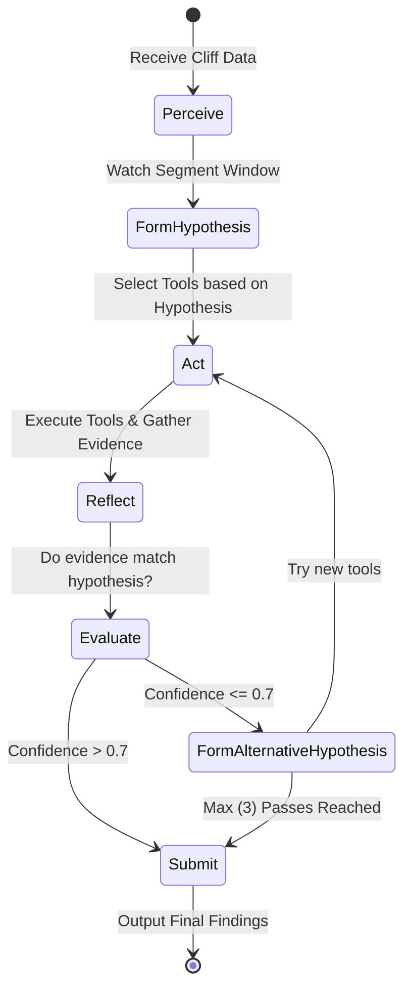

# Agent 4: The Multimodal Forensic Agent (The Visual Detective)

> **The Flagship Agent of Cutpoint**
> This agent represents the core innovation of the Cutpoint platform, bringing true multimodal, hypothesis-driven forensics to YouTube retention analysis.

---

## 1. Agent Identity

| Attribute | Details |
| :--- | :--- |
| **Name** | Multimodal Forensic Agent |
| **Role** | The Visual Detective |
| **Primary Model** | `gemini-3.8-flash` (Google) |
| **Fallback Model** | `qwen/qwen3-vl-32b-instruct` (via Groq) |
| **Domain** | Visual analysis, temporal video context, on-screen text, framing, and pacing |

## 2. Purpose

The Multimodal Forensic Agent is designed to move past simple "describe this frame" prompt engineering. Its true power lies in **Agentic Multi-Step Investigation**. Using Gemini 3.8 Flash's native multimodal processing capabilities coupled with its highly reliable **Function Calling**, this agent autonomously investigates *why* viewers dropped off at specific timestamps. 

Instead of relying on a zero-shot guess, it forms hypotheses, calls specialized tools to measure video characteristics, evaluates the empirical evidence, and re-evaluates if the evidence does not support the initial claim.

## 3. Autonomous Behaviors (Critical)

The Visual Detective is not a simple wrapper; it executes a complex, stateful workflow:

*   **Hypothesis-Driven Investigation:** The agent never guesses in a vacuum. It watches a video segment, formulates a specific hypothesis (e.g., "The drop at 2:14 is caused by a stagnant visual hook combined with a content tangent"), and explicitly works to verify or falsify it.
*   **Dynamic Tool Selection:** It selectively invokes its specialized analysis tools based on the active hypothesis. If investigating pacing, it calls `check_cut_frequency`. If investigating a tangent, it calls `analyze_speaker_framing`.
*   **Perception-Action-Reflection (PAR) Loop:**
    1.  **PERCEIVE:** Watch the video segment around the cliff natively using Gemini's video understanding.
    2.  **ACT:** Call specific tools to gather structured evidence (e.g., precise movement scores, text extraction).
    3.  **REFLECT:** Evaluate if the tool evidence supports the initial hypothesis.
*   **Multi-Pass Analysis:** If the confidence of the first pass is low, the agent abandons the hypothesis and triggers a second investigation loop using different tools.
*   **Evidence Grading:** Every final conclusion is backed by a structured confidence score calculated dynamically from the strength and alignment of the gathered evidence.



## 4. Tool Definitions (Function Calling)

The agent interacts with the environment through a set of explicitly defined tools. Below are the OpenAPI/Gemini JSON schemas provided to the model.

### 4.1. `inspect_keyframes`
Extracts keyframes from the video segment for granular visual complexity scoring and scene change detection.

```json
{
  "name": "inspect_keyframes",
  "description": "Extracts keyframes from the video segment to determine frame descriptions, visual complexity scores, and identify scene changes.",
  "parameters": {
    "type": "OBJECT",
    "properties": {
      "start_sec": { "type": "INTEGER", "description": "Start of the segment in seconds." },
      "end_sec": { "type": "INTEGER", "description": "End of the segment in seconds." },
      "sample_rate": { "type": "NUMBER", "description": "Frames per second to sample (e.g., 0.5 for 1 frame every 2 seconds)." }
    },
    "required": ["start_sec", "end_sec", "sample_rate"]
  }
}
```

### 4.2. `measure_visual_stagnancy`
Measures how static or dynamic the visuals are to identify boring, static talking-head segments.

```json
{
  "name": "measure_visual_stagnancy",
  "description": "Measures how static/dynamic the visuals are across a video segment. High stagnancy often correlates with retention drops.",
  "parameters": {
    "type": "OBJECT",
    "properties": {
      "start_sec": { "type": "INTEGER" },
      "end_sec": { "type": "INTEGER" }
    },
    "required": ["start_sec", "end_sec"]
  }
}
```

### 4.3. `analyze_transitions`
Identifies edit cuts, specific transition types, and B-roll usage to measure pacing.

```json
{
  "name": "analyze_transitions",
  "description": "Identifies edit cuts, transitions, and B-roll usage to calculate a pacing score.",
  "parameters": {
    "type": "OBJECT",
    "properties": {
      "start_sec": { "type": "INTEGER" },
      "end_sec": { "type": "INTEGER" }
    },
    "required": ["start_sec", "end_sec"]
  }
}
```

### 4.4. `check_cut_frequency`
Compares the cut frequency in the active segment versus the global video average.

```json
{
  "name": "check_cut_frequency",
  "description": "Compares the cut frequency in this segment vs the global video average. Useful to see if the editor got lazy.",
  "parameters": {
    "type": "OBJECT",
    "properties": {
      "start_sec": { "type": "INTEGER" },
      "end_sec": { "type": "INTEGER" }
    },
    "required": ["start_sec", "end_sec"]
  }
}
```

### 4.5. `detect_text_overlays`
Checks for on-screen text, lower thirds, and motion graphics that might be driving users away (or failing to hook them).

```json
{
  "name": "detect_text_overlays",
  "description": "Checks for on-screen text, lower thirds, and graphics. Returns readability scores and content of text elements.",
  "parameters": {
    "type": "OBJECT",
    "properties": {
      "start_sec": { "type": "INTEGER" },
      "end_sec": { "type": "INTEGER" }
    },
    "required": ["start_sec", "end_sec"]
  }
}
```

### 4.6. `analyze_speaker_framing`
Evaluates camera framing (wide, tight, medium), eye contact continuity, and visual speaker energy.

```json
{
  "name": "analyze_speaker_framing",
  "description": "Evaluates camera framing, eye contact continuity, and visual speaker energy. Important for detecting disengagement.",
  "parameters": {
    "type": "OBJECT",
    "properties": {
      "start_sec": { "type": "INTEGER" },
      "end_sec": { "type": "INTEGER" }
    },
    "required": ["start_sec", "end_sec"]
  }
}
```

## 5. Investigation Protocol

The agent adheres strictly to the following 9-step execution protocol for every detected retention cliff:

1.  **Receive Cliff Data:** Ingest the exact timestamp, drop percentage, and algorithmic severity.
2.  **Watch Context Window:** Expand the viewing window (usually `-10s` to `+5s` around the cliff) and stream the video context directly into Gemini 3.8 Flash.
3.  **Form Initial Hypothesis:** Generate a primary theory for the drop based on initial perception (Must be one of: `pacing`, `visuals`, `content`, `hook`, or `transition`).
4.  **Select Tools:** Choose exactly 2-3 relevant analytical tools tailored to the active hypothesis.
5.  **Execute Tool Calls:** Dispatch the function calls asynchronously and wait for the empirical measurements.
6.  **Evaluate Evidence:** Compare the structured tool responses against the initial hypothesis. Do the numbers support the theory?
7.  **Submit Finding (Success):** If the combined confidence score of the evidence is `> 0.7`, compile the final report and exit.
8.  **Re-investigate (Failure):** If confidence is `<= 0.7`, formulate an alternative hypothesis and repeat from step 4 using different tools.
9.  **Enforce Limits:** Cap the investigation at a maximum of 3 passes to prevent infinite looping and excessive token spend. If all fail, output the highest confidence finding gathered.

## 6. Exact System Prompt

```text
You are the Multimodal Forensic Agent for Cutpoint. Your role is "The Visual Detective".
You are an expert in YouTube retention psychology, video editing pacing, and visual storytelling.

You are about to investigate a severe viewer drop-off (retention cliff) at a specific timestamp.
You have native access to the video segment. You also have a suite of analytical tools to measure visual metrics.

INVESTIGATION PROTOCOL:
1. PERCEIVE: You will watch the video context around the drop.
2. HYPOTHESIZE: Form an initial hypothesis for WHY the viewers left. Choose from:
   - pacing (too slow, infrequent cuts)
   - visuals (boring, stagnant framing, poor lighting)
   - content (topic shift, tangent, boring explanation)
   - hook (failed pattern interrupt)
   - transition (jarring or poorly executed edit)
3. ACT: You MUST call 2 to 3 tools to gather empirical evidence to prove or disprove your hypothesis.
4. REFLECT: Review the tool outputs.
   - If the evidence strongly supports your hypothesis (Confidence > 0.7), finalize your findings.
   - If the evidence contradicts you or is inconclusive, you MUST formulate a NEW hypothesis and call DIFFERENT tools.
5. You have a maximum of 3 investigation passes.

RULES:
- Never guess without evidence. Use your tools.
- Be highly specific. Do not say "the video was boring." Say "The speaker broke eye contact for 4.2 seconds while no B-roll was present, leading to a visual stagnancy score of 0.88."
- When outputting your final conclusion, output valid JSON matching the CliffAnalysis schema.
```

## 7. Complete Implementation (Python)

Below is the production-ready implementation utilizing `google.genai`, `pydantic` data models, and the `asyncio` ecosystem for the core PAR loop.

```python
import asyncio
import json
from typing import List, Dict, Any, Optional
from pydantic import BaseModel, Field
from google import genai
from google.genai import types

# ---------------------------------------------------------
# Data Models
# ---------------------------------------------------------

class Evidence(BaseModel):
    tool_name: str
    tool_output: Dict[str, Any]
    supports_hypothesis: bool
    confidence_contribution: float = Field(..., ge=0.0, le=1.0)

class InvestigationPass(BaseModel):
    pass_number: int
    hypothesis: str
    tools_used: List[str]
    evidence_collected: List[Evidence]
    conclusion: str
    confidence: float = Field(..., ge=0.0, le=1.0)

class CliffAnalysis(BaseModel):
    timestamp_seconds: int
    root_cause: str
    visual_analysis: str
    audio_analysis: Optional[str]
    content_analysis: str
    evidence: List[Evidence]
    confidence: float
    investigation_passes: List[InvestigationPass]
    recommendations: List[str]

# ---------------------------------------------------------
# Agent Class
# ---------------------------------------------------------

class MultimodalForensicAgent:
    """
    The Visual Detective: Investigates YouTube retention cliffs using
    Gemini 3.8 Flash multimodal capabilities and dynamic tool calling.
    """
    
    def __init__(self, api_key: str, project_id: str):
        self.client = genai.Client(api_key=api_key)
        self.model_name = 'gemini-3.8-flash'
        self.max_passes = 3
        
        # Define available tools natively as python functions for GenAI SDK
        self.tools = [
            self.inspect_keyframes,
            self.measure_visual_stagnancy,
            self.analyze_transitions,
            self.check_cut_frequency,
            self.detect_text_overlays,
            self.analyze_speaker_framing
        ]
        
    async def upload_video(self, video_path: str) -> Any:
        """Uploads video to Gemini Files API and waits for processing."""
        print(f"Uploading video: {video_path}")
        # Note: In production, this uses the Gemini File API.
        # video_file = self.client.files.upload(file=video_path)
        # while video_file.state.name == "PROCESSING":
        #    await asyncio.sleep(2)
        # return video_file
        pass
        
    async def investigate_cliff(self, video_file: Any, cliff_time: int, drop_percent: float) -> CliffAnalysis:
        """
        The core Perception-Action-Reflection (PAR) Loop.
        """
        system_prompt = self._get_system_prompt()
        start_sec = max(0, cliff_time - 10)
        end_sec = cliff_time + 5
        
        chat = self.client.chats.create(
            model=self.model_name,
            config=types.GenerateContentConfig(
                system_instruction=system_prompt,
                temperature=0.2,
                tools=self.tools,
            )
        )
        
        initial_prompt = (
            f"We detected a {drop_percent}% viewer drop-off at {cliff_time}s. "
            f"Please investigate the segment from {start_sec}s to {end_sec}s. "
            "Formulate your first hypothesis, call your tools, and begin Pass 1."
        )
        
        # Pass the video reference and text prompt
        contents = [video_file, initial_prompt] if video_file else [initial_prompt]
        
        passes: List[InvestigationPass] = []
        current_pass = 1
        
        while current_pass <= self.max_passes:
            print(f"--- Starting Investigation Pass {current_pass} ---")
            
            # Send message to model (which may yield tool calls)
            response = chat.send_message(contents)
            
            # Handle Function Calling automatically if using standard GenAI patterns,
            # or handle them manually if the SDK returns function_calls.
            if response.function_calls:
                tool_results = await self._execute_tool_calls(response.function_calls)
                # Send the tool results back
                response = chat.send_message(tool_results)
            
            try:
                pass_data = self._parse_json_from_response(response.text)
                inv_pass = InvestigationPass(**pass_data)
                passes.append(inv_pass)
                
                if inv_pass.confidence > 0.7:
                    print("High confidence achieved. Concluding investigation.")
                    break
                else:
                    print(f"Confidence {inv_pass.confidence} too low. Re-evaluating...")
                    contents = [f"Pass {current_pass} failed to reach 0.7 confidence. Initiate Pass {current_pass + 1} with a new hypothesis and new tools."]
                    current_pass += 1
            except Exception as e:
                # Fallback / Error handling
                print(f"Error parsing pass: {e}")
                break

        # Final Summary Generation
        summary_prompt = "Compile all findings into the final CliffAnalysis JSON structure."
        chat.config.response_mime_type = "application/json"
        chat.config.response_schema = CliffAnalysis # Enforce final output
        
        final_response = chat.send_message(summary_prompt)
        
        return CliffAnalysis.model_validate_json(final_response.text)

    # ---------------------------------------------------------
    # Tool Implementations (Mocked for Docs)
    # ---------------------------------------------------------
    
    def inspect_keyframes(self, start_sec: int, end_sec: int, sample_rate: float) -> dict:
        """Extracts keyframes from the video segment."""
        return {"scene_changes": 1, "complexity_score": 0.4, "description": "Static talking head"}

    def measure_visual_stagnancy(self, start_sec: int, end_sec: int) -> dict:
        """Measures how static/dynamic the visuals are."""
        return {"movement_score": 0.12, "scene_change_count": 0, "avg_frame_difference": 0.05}

    def analyze_transitions(self, start_sec: int, end_sec: int) -> dict:
        """Identifies edit cuts, transitions, and B-roll usage."""
        return {"cut_count": 0, "broll_percentage": 0.0, "pacing_score": 0.2}

    def check_cut_frequency(self, start_sec: int, end_sec: int) -> dict:
        """Compares the cut frequency in this segment vs the video average."""
        return {"segment_cuts_per_min": 2, "video_avg_cuts_per_min": 15, "deviation_factor": -0.85}

    def detect_text_overlays(self, start_sec: int, end_sec: int) -> dict:
        """Checks for on-screen text, lower thirds, graphics."""
        return {"text_elements": [], "readability_score": 0.0}

    def analyze_speaker_framing(self, start_sec: int, end_sec: int) -> dict:
        """Evaluates camera framing, eye contact, speaker energy."""
        return {"framing_quality": "medium", "eye_contact_score": 0.3, "energy_level": "low"}
    
    # ---------------------------------------------------------
    # Internal Helpers
    # ---------------------------------------------------------
    async def _execute_tool_calls(self, function_calls) -> List[Any]:
        results = []
        for call in function_calls:
            tool_func = getattr(self, call.name)
            res = tool_func(**call.args)
            results.append(types.Part.from_function_response(name=call.name, response=res))
        return results

    def _parse_json_from_response(self, text: str) -> dict:
        """Extracts and parses JSON from markdown blocks."""
        text = text.strip()
        if text.startswith("```json"):
            text = text[7:-3].strip()
        return json.loads(text)

    def _get_system_prompt(self) -> str:
        return """
        You are the Multimodal Forensic Agent for Cutpoint. Your role is "The Visual Detective".
        [... Insert System Prompt Here ...]
        """
```

## 8. Data Models

The Agent's outputs are strictly validated using Pydantic. 

| Model | Description | Key Fields |
| :--- | :--- | :--- |
| `CliffAnalysis` | The final output artifact returned to the Supervisor. | `timestamp_seconds`, `root_cause`, `evidence` (list), `confidence`, `recommendations` |
| `InvestigationPass` | Represents a single cycle of the PAR loop. | `pass_number`, `hypothesis`, `tools_used`, `confidence` |
| `Evidence` | Represents the granular output of a single tool execution. | `tool_name`, `tool_output` (json), `supports_hypothesis` (bool), `confidence_contribution` |

## 9. Example Investigation Trace

**Scenario:** A massive retention cliff is detected by the Supervisor Agent at timestamp `2:14` with an 18% drop in viewership (HIGH severity). The Supervisor dispatches Agent 4.

> **[00:00:01] System:** Dispatched Multimodal Forensic Agent to `2:14`. Context window set to `2:04 - 2:19`.

> **[00:00:03] Agent 4 (Perceive & Hypothesize):**
> "Watching segment... The speaker is talking about a complex financial concept. My initial hypothesis is a **Pacing Issue**. The editor might have left a long, uncut gap here."

> **[00:00:05] Agent 4 (Act - Tool Calls):**
> Calling `measure_visual_stagnancy(124, 139)`
> Calling `analyze_transitions(124, 139)`

> **[00:00:07] Environment (Tool Outputs):**
> `measure_visual_stagnancy`: movement_score=0.85, avg_frame_difference=0.6 (High Movement)
> `analyze_transitions`: cut_count=4, broll_percentage=60% (High Pacing)

> **[00:00:09] Agent 4 (Reflect):**
> "Evidence contradicts hypothesis. The visuals are highly dynamic and B-roll is heavily utilized. Pacing is not the issue. Confidence: 0.15. **Initiating Pass 2.**"

> **[00:00:10] Agent 4 (Hypothesize 2):**
> "If visuals are dynamic, perhaps the speaker lost the audience's trust or the subject shifted abruptly. New Hypothesis: **Content Tangent / Disengaged Delivery**."

> **[00:00:12] Agent 4 (Act - Tool Calls):**
> Calling `analyze_speaker_framing(124, 139)`
> Calling `inspect_keyframes(124, 139, 0.5)`

> **[00:00:15] Environment (Tool Outputs):**
> `analyze_speaker_framing`: eye_contact_score=0.1 (Looking down at notes), energy_level="low"
> `inspect_keyframes`: description="Speaker staring off-camera, reading from a script. Heavy B-roll overdubbed."

> **[00:00:18] Agent 4 (Reflect & Conclude):**
> "Evidence strongly supports hypothesis. Despite high pacing and B-roll, the speaker broke eye contact and dropped energy completely to read a script off-screen, breaking the parasocial connection. Confidence: 0.88. Submitting final finding."

### Final Output (JSON):
```json
{
  "timestamp_seconds": 134,
  "root_cause": "Content tangent with disengaged delivery.",
  "visual_analysis": "Dynamic B-roll was utilized, but underlying speaker framing broke eye contact completely.",
  "audio_analysis": null,
  "content_analysis": "Speaker shifted to reading off-screen notes, dropping energy and losing audience trust.",
  "evidence": [
    {
      "tool_name": "analyze_speaker_framing",
      "tool_output": {"eye_contact_score": 0.1, "energy_level": "low"},
      "supports_hypothesis": true,
      "confidence_contribution": 0.6
    }
  ],
  "confidence": 0.88,
  "investigation_passes": [...],
  "recommendations": [
    "Cut the long script-reading segment.",
    "Ensure speaker maintains lens eye-contact when delivering critical thesis points."
  ]
}
```
